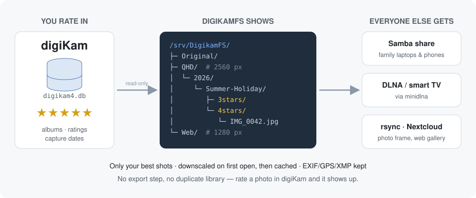

<h1 align="center">DigikamFS</h1>

<p align="center">
  <b>Your digiKam star ratings as a live, shareable photo filesystem.</b><br>
  Rate in digiKam &ndash; the TV, the family laptop and the photo frame get only your best shots, in the right size, always up to date.
</p>

<p align="center">
  <a href="https://github.com/euphi/DigikamFS/actions/workflows/ci.yml"></a>
  <a href="LICENSE"></a>
  
  
</p>

<p align="center">
  
</p>

*Eine deutsche Fassung dieser Dokumentation liegt unter
[README.de.md](README.de.md).*

## Why?

digiKam is great at managing a large photo library &ndash; but the moment you
want to show the *good* photos somewhere else, you are back to exporting:
select by rating, resize, copy, and repeat every time you rate something new.
The exported copies go stale, eat disk space, and nobody remembers which
folder is current.

DigikamFS removes the export step. It reads albums and star ratings straight
from the digiKam SQLite database and mounts them as a read-only FUSE
filesystem:

```
<mountpoint>/<ResolutionProfile>/<Year>/<Album>/<N>stars/<Filename>
```

Point Samba, minidlna, rsync or the Nextcloud client at it and every device
sees a clean, rating-filtered, correctly sized view of your library. Give a
photo four stars in digiKam and a few minutes later it appears in the
`4stars` folder on the living-room TV.

## Features

- **Zero-export sharing** &ndash; one virtual folder per rating threshold
  (`3stars` = rated 3 or better, `4stars` = 4 or better, ...), grouped by year
  and album, exactly as organised in digiKam.
- **Multiple resolutions side by side** &ndash; e.g. `Original/`, `QHD/`
  (2560&nbsp;px) and `Web/` (1280&nbsp;px) as parallel top-level trees.
- **Lazy downscaling with a real cache** &ndash; images are resized on first
  *open*, never while browsing; `ls -l` stays instant even on huge libraries.
- **Metadata preserved** &ndash; EXIF (incl. orientation), GPS, IPTC and XMP
  are copied to the resized file with `exiftool`.
- **Capture date as file date** &ndash; file timestamps come from digiKam's
  creation date, so TVs and galleries sort chronologically.
- **Always current** &ndash; the index is rebuilt in the background
  (default: every 5 minutes) without interrupting readers.
- **Friendly to SMB/DLNA clients** &ndash; stable inode numbers across
  refreshes, atomic cache writes, background prefetch of the next photo.
- **Safe by design** &ndash; the digiKam database and your originals are only
  ever read, never written.
- **Batteries included** &ndash; systemd unit, Samba share generator and a
  cache pre-warm command.

## Quick start

```bash
# 1. Install (Debian/Ubuntu; see "Installation" below for details)
sudo apt install libfuse3-dev fuse3 pkg-config python3-venv libimage-exiftool-perl
git clone https://github.com/euphi/DigikamFS && cd DigikamFS
python3 -m venv venv && . venv/bin/activate
pip install -e .

# 2. Configure
cp config.example.yaml config.yaml
$EDITOR config.yaml        # set digikam_db, cache_dir, profiles
                           # tip: star_dir_format: "{n}stars" for English folder names

# 3. Check that your database matches the defaults
digikamfs debug-db -c config.yaml

# 4. Mount
mkdir -p /srv/DigikamFS
digikamfs mount /srv/DigikamFS -c config.yaml
```

Then share `/srv/DigikamFS` with Samba or minidlna (examples below), or run
it permanently with the bundled [systemd unit](contrib/digikamfs.service).

## Installation

```bash
sudo apt install libfuse3-dev fuse3 pkg-config python3-venv libimage-exiftool-perl
python3 -m venv venv
source venv/bin/activate
pip install -r requirements.txt
pip install -e .
```

The editable install is what provides the `digikamfs` command and makes the
package importable regardless of the working directory -- which the systemd
unit below relies on. Without it, the commands below still work, but only when
run from the project directory and spelled `python3 -m digikamfs`.

`exiftool` is required for every profile that performs downscaling; it copies
EXIF/IPTC/XMP/GPS data from the original file to the resized version. It is
not needed when only the `Original` passthrough profile is used -- this is
checked at startup, and a clear error is reported if `exiftool` is missing
while being required.

## Before first use: verifying the database assumptions

Photos are filtered by `Images.status = 1` (visible, neither trashed nor
hidden) and `Images.category = 1` (image, not video or audio). These values
match current digiKam versions, but they should be verified against the local
database before being relied upon:

```bash
python3 -m digikamfs debug-db -c config.yaml
```

The command reports the `status`, `category` and `rating` values that actually
occur, together with their counts. If the local values differ, set
`status_visible_value` / `category_image_value` accordingly in `config.yaml`.

## Configuration

See `config.example.yaml`; copy it to `config.yaml` and adjust:

- `digikam_db`: path to `digikam4.db`
- `cache_dir`: location of the downscaled JPEGs
- `profiles`: one top-level directory per resolution; `null` means the
  original without downscaling (passthrough, no additional storage required)
- `star_levels`: which rating directories are created (default `[3, 4]`)
- `star_dir_format`: name of the rating directories, `{n}` is replaced by the
  threshold. The default `"{n}Sterne"` (German for "stars") yields `3Sterne`;
  use `"{n}stars"` or `"{n}+ stars"` for English names.

## Usage

**Mounting** (blocks in the foreground; see the systemd unit below for
permanent operation):

```bash
mkdir -p /srv/DigikamFS
python3 -m digikamfs mount /srv/DigikamFS -c config.yaml
```

Terminate with Ctrl+C, or from another terminal:
`fusermount3 -u /srv/DigikamFS`

**Warming the cache** (optional -- not required for normal browsing, since
`getattr`/`ls -l` never generate anything, see below; useful only when
everything should be cached ahead of a known usage peak, such as a family
gathering in front of a DLNA television):

```bash
python3 -m digikamfs prewarm -c config.yaml
```

## How it works / design decisions

- **In-memory index**: the database is not queried on every `ls`. It is read
  once at startup and reloaded in the background every
  `refresh_interval_seconds` (reference swap; accesses in flight are not
  interrupted).
- **Stable inode numbers**: each inode is derived deterministically from the
  hash of the virtual path rather than being counted upwards. A file therefore
  keeps the same inode number across an index refresh -- important for kernel
  caching and SMB clients. With very large collections a hash collision is
  theoretically possible, but negligible in practice for a private photo
  library.
- **A real cache, filled only on real access**: `getattr`/`readdir` -- that
  is, plain browsing and `ls -l` -- *never* generate anything. They only
  perform a cheap check for an existing valid cache file and otherwise report
  the original size as an estimate. Downscaling happens exclusively in
  `open()`, i.e. when a file is actually read, copied or displayed. Browsing
  therefore stays fast, and the cache grows only with what is really used
  rather than with everything that has ever been listed in a directory.
- **Prefetch**: when a file is actually opened, the alphabetically next file
  in the same rating directory is converted in the background, without
  delaying the current access. When browsing through an album, the next file
  is usually already cached before it is opened. This runs in a dedicated
  background nursery and deduplicates against real accesses, so the same file
  is never resized twice concurrently.
- **Reported date = capture date**: the file timestamps (mtime/atime/ctime)
  reported over FUSE come from `ImageInformation.creationDate` in the digiKam
  database (falling back to `digitizationDate`, and then to the actual file
  mtime if both are missing) rather than from the filesystem mtime of the
  original. Internally, cache invalidation still uses the real file mtime,
  independently of this, so modifications to the original are detected
  reliably.
- **Metadata is preserved**: EXIF (including orientation), GPS, IPTC and XMP
  are transferred unchanged from the original to the resized file by
  `exiftool` after the resize. Only the now-incorrect EXIF dimension tags
  (`ExifImageWidth`/`Height`) are excluded; the actual pixel size is recorded
  correctly in the JPEG itself anyway. The pixels are deliberately *not*
  rotated beforehand -- the orientation tag remains unchanged, so a viewer
  that honours it displays the resized image exactly like the original.
- **Size estimate before first open**: until a file has been opened for the
  first time, `ls -l` reports the original file size instead of the smaller
  target size. Copy tools read until EOF and do not rely blindly on the
  reported size, so this is uncritical -- only the display before first access
  is an upper-bound estimate.
- **Cache invalidation**: a cache file is considered valid while its mtime is
  greater than or equal to the mtime of the original. If the original changes,
  the file is regenerated on next access.
- **Atomic creation**: the resize writes to a temporary file and renames it
  only afterwards (`os.replace`), so concurrent readers (multiple SMB clients)
  never see a truncated file.

## Known limitations

- Only standard JPEGs are processed; RAW files and videos are hidden entirely
  (intentional, as per the requirements).
- digiKam ratings are assumed to be stored reliably in the database. The
  database is used rather than per-file EXIF/XMP because it is considerably
  faster.
- No write access: the filesystem is deliberately mounted read-only.

## Troubleshooting: minidlna/Samba "Permission denied"

By kernel default, FUSE mounts are accessible **only to the user who mounted
them**, regardless of the file permissions being reported. If minidlna, smbd
or a similar service runs under its own user (`minidlna`, for example, rather
than the user who ran `digikamfs mount`), it receives a "Permission denied"
without further configuration, even though `ls -la` shows
`dr-xr-xr-x`/`-r--r--r--` for the mounting user. This is standard FUSE
behaviour, not a digikamfs bug.

Fix (enabled by default, see `allow_other: true` in `config.example.yaml`):

1. Make sure the configuration contains `allow_other: true`.
2. If `digikamfs mount` does *not* run as root (for example via systemd with
   `User=someuser`), uncomment the line
   ```
   user_allow_other
   ```
   in `/etc/fuse.conf` once (removing the leading `#`). This step is
   unnecessary when the mount runs as root.
3. Restart the mount (`systemctl restart digikamfs`, or restart the process).

Afterwards, verify as the other user (for example
`sudo -u minidlna ls /media/DigikamFS/QHD`) before restarting minidlna or
Samba themselves.

If access still fails, check whether minidlna/smbd runs in its own mount
namespace due to systemd hardening (`ProtectHome=`, `PrivateMounts=`,
`ProtectSystem=strict` and similar), which may hide the FUSE mount entirely.
That case usually presents as "no such directory" rather than "Permission
denied".

## Example: Samba share

```ini
[Fotos]
   path = /srv/DigikamFS
   read only = yes
   browseable = yes
   guest ok = no
```

One share per resolution profile can also be generated automatically from the
top-level directories of the mountpoint:

```bash
sudo /path/to/venv/bin/digikamfs-smb-shares \
    --mount-point /srv/DigikamFS \
    --smb-user digikamfs \
    --smb-group digikamfs
```

The script writes `/etc/samba/digikamfs-shares.conf` atomically; that file is
meant to be pulled into `smb.conf` via `include`. It has to be re-run whenever
resolution profiles are added to or removed from the configuration.

## Example: systemd service for permanent operation

`/etc/systemd/system/digikamfs.service`:

A ready-to-adapt copy of this unit is included as
[contrib/digikamfs.service](contrib/digikamfs.service).

```ini
[Unit]
Description=DigikamFS (read-only FUSE view of digiKam albums)
After=local-fs.target
# Start Samba only once the mount is up (harmless if smb.service is disabled).
Before=smb.service

[Service]
Type=simple
User=someuser
Group=someuser
ExecStart=/path/to/venv/bin/digikamfs mount /srv/DigikamFS -c /path/to/config.yaml
ExecStop=/usr/bin/fusermount3 -u /srv/DigikamFS
Restart=on-failure
RestartSec=5
TimeoutStopSec=30

[Install]
WantedBy=multi-user.target
```

Two details matter here:

- `ExecStart` uses the `digikamfs` console script from the virtualenv, which
  requires `pip install -e .` (see Installation). The module form
  `python3 -m digikamfs` resolves the package through the current directory,
  and systemd starts services in `/` -- it therefore needs an additional
  `WorkingDirectory=/path/to/project` to work.
- Sandboxing options such as `ProtectHome=`, `ProtectSystem=strict` or
  `PrivateMounts=` must **not** be added. They place the service in its own
  mount namespace, which makes the FUSE mount invisible to smbd/minidlna --
  the failure mode described under Troubleshooting, usually surfacing as "no
  such directory".

Enable and inspect the service with:

```bash
sudo systemctl daemon-reload
sudo systemctl enable --now digikamfs
journalctl -u digikamfs -f
```

For a nightly cache warm-up, add a cron job or systemd timer running
`python3 -m digikamfs prewarm -c config.yaml`.

## Tests

`test_pipeline.py` builds a synthetic digiKam database together with real test
JPEGs and exercises the complete pipeline (database query, tree construction,
star filtering, video exclusion, resize, cache hit, inode stability) without
an actual mount:

```bash
python3 test_pipeline.py
```

The project has also been verified against a real FUSE mount (readdir,
getattr, open/read, `cp`), so it is known to work in practice rather than
being only theoretically correct. CI runs the test on every push, together
with `ruff check .` and a packaging check.

## Roadmap / ideas

Contributions and feedback are very welcome. Things that would fit well:

- HEIC/HEIF and RAW support (via embedded previews)
- Filtering by digiKam tags, colour labels or pick labels in addition to stars
- Videos as passthrough files
- Packaging for PyPI / distributions

Have another use case? [Open an issue](https://github.com/euphi/DigikamFS/issues)
&ndash; see [CONTRIBUTING.md](CONTRIBUTING.md).

## License

MIT -- see [LICENSE](LICENSE).
